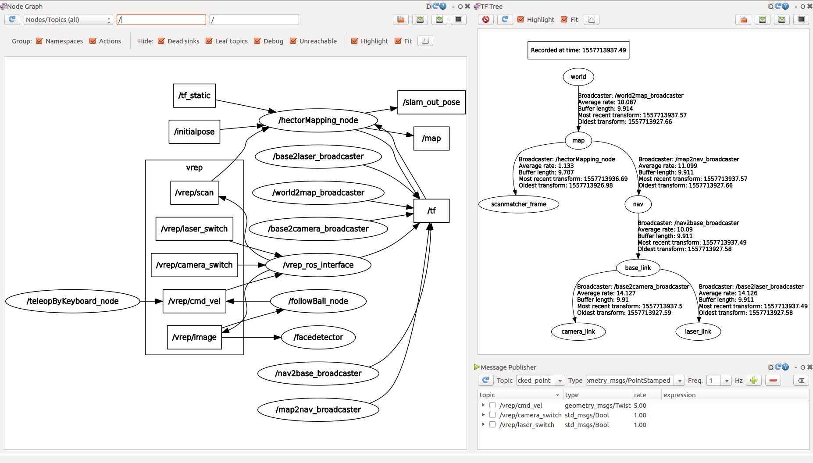
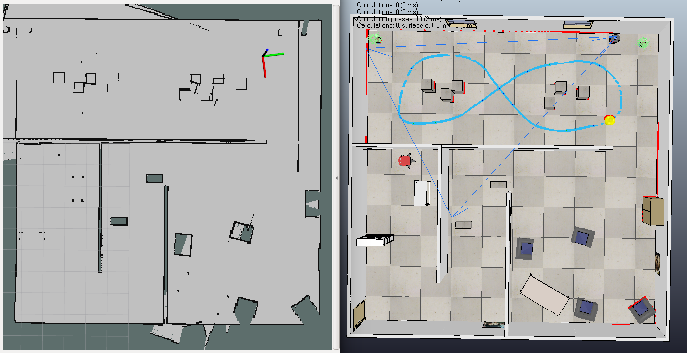
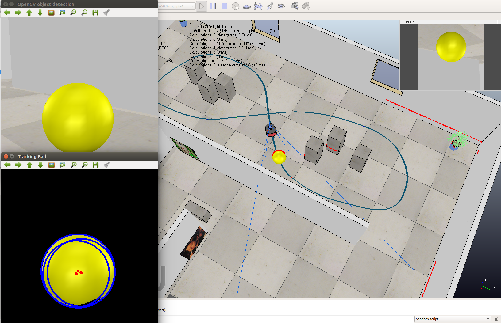
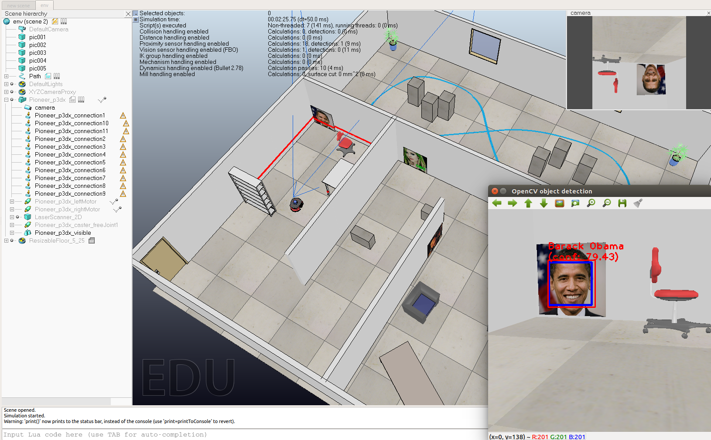

# Mobile Robot SLAM based on V-Rep & ROS

# 0. Prerequisit
- ROS Kinetic on Ubuntu 16.04
- V-REP_PRO_EDU_V3_5_0_Linux


## 0.1 V-Rep & ROS Interface Instruction
1. Download V-REP_PRO_EDU_V3_5_0_Linux. 
2. Run ./VRep_folder/vrep.sh 
3. Add the root path of vrep to the environment variable with name VREP ROOT in the .bashrc file
4. Copy the vrep_ros_interface folder to your catkin workspace and catkin_make it.
5. After successfully compiled, copy the libv repExtRosInterface.so from /catkin ws/devel/lib/libv to your V-Rep root folder.

## 0.2 Environment Test
1. Launch ROS
```shell
roscore
```

2. Launch V-REP
Make sure the log shows "Plugin 'RosInterface': loading... Plugin 'RosInterface': load succeeded."
```shell
cd v-rep_folder/
./vrep.sh
```


# 1. Launch everything together
```shell
# cd to this workspace
roslaunch all.launch
```
The nodes and topic graph could be visualized by rqt, as shown below.




# 2. Run sub-tasks
## 2.1 Tele-operate by Keyboard
```shell
rosrun teleop_by_keyboard teleop_by_keyboard.py
```

## 2.2 Hector Mapping
Here we use the [*Hcetor SLAM*](http://wiki.ros.org/hector_slam) package. The Source Code is provided [here](https://github.com/tu-darmstadt-ros-pkg/hector_slam.git). This package could also be installed on your ROS by apt install. 
```shell
sudo apt-get install ros-indigo-hector-slam
```

Then you can test this package by running a rosbag of [Team_Hector_MappingBox_RoboCup_2011_Rescue_Arena](https://github.com/uscrs-art/beohawk-ros/blob/master/hector_slam/Team_Hector_MappingBox_RoboCup_2011_Rescue_Arena.bag)
```shell
roslaunch hector_slam_launch tutorial.launch
# cd to the rosbag location
rosbag play Team_Hector_MappingBox_RoboCup_2011_Rescue_Arena.bag --clock
# Finally the generated geotiff maps could be saved to the 'hector_slam/hector_geotiff/maps' folder. 
rostopic pub syscommand std_msgs/String "savegeotiff" 

```

For this task, you can directly launch the laser scanner mapping.  
```shell
# cd to this workspace
# The camera is switch to false in this launch file to accelerate simulation 
roslaunch mapping.launch 
```
The comparison between the mapping result and the true scene is shown below.


## 2.3 Ball Tracking
For tracking the yellow ball, firstly we extract the ball contour by applying the [*Hough Circle Transformation*](https://docs.opencv.org/2.4/doc/tutorials/imgproc/imgtrans/hough_circle/hough_circle.html) to the blurred image. Then a series of velocity commands is calculated based on the cicle center coordinator in the image. Demo is shown [here](https://youtu.be/2p4u3J0AaR8)

```shell
rosrun visual_servo follow_ball
```
The yellow ball tracking result is shown below.




## 2.4 Face Recognition
- The face detection part is implemented by adjusting the [**ViCoS Lab ROS packages**](https://github.com/vicoslab/vicos_ros) of OpenCV object detection. Here the face detection is based on [*Haar feature-based cascade classifiers*](https://docs.opencv.org/3.4.1/d7/d8b/tutorial_py_face_detection.html), which is an effective object detection method proposed by Paul Viola in their paper ["Rapid Object Detection using a Boosted Cascade of Simple Features"](https://www.cs.cmu.edu/~efros/courses/LBMV07/Papers/viola-cvpr-01.pdf).

- Besides face detection, we also recognize the faces on the wall. The face recognization method is referred to [*LBPHFaceRecognizer*](https://docs.opencv.org/3.4/df/d25/classcv_1_1face_1_1LBPHFaceRecognizer.html) in OpenCV.

```shell
roslaunch opencv_detector face.launch
```
The face recognition result is shown below.




## Author
- SONG Haoran
- LIU Shuai

## Acknowledgment
This is the final project of ELEC6910R & COMP6211C -- Robotic Perception and Learning taught by Prof. LIU Ming in HKUST. 
